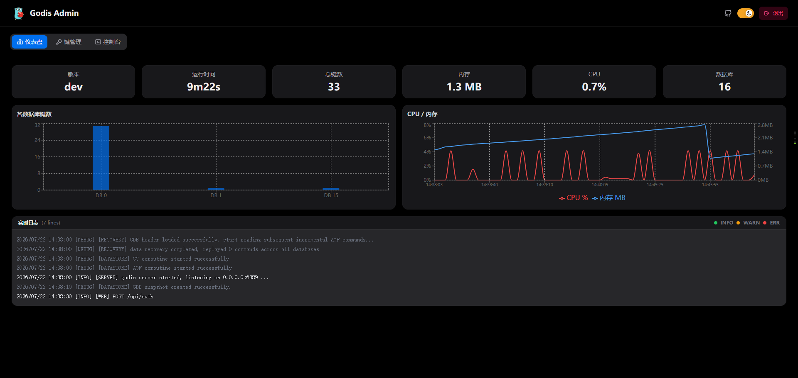
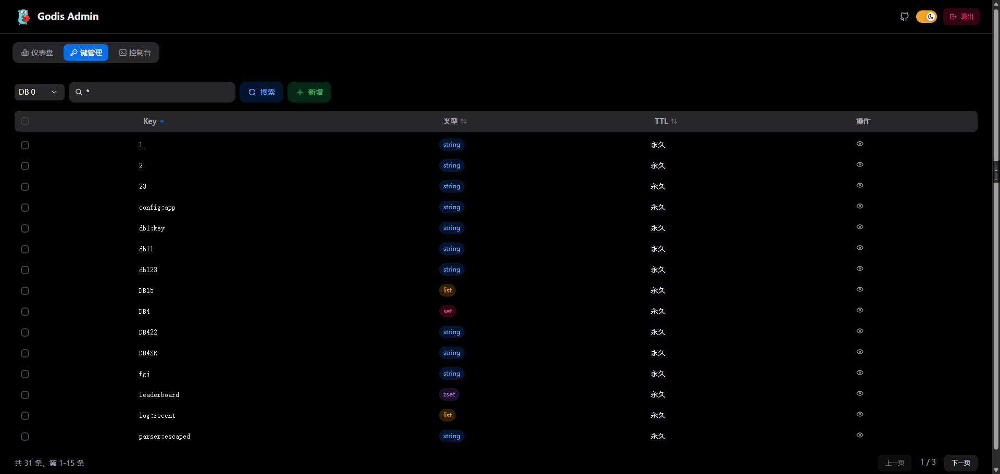
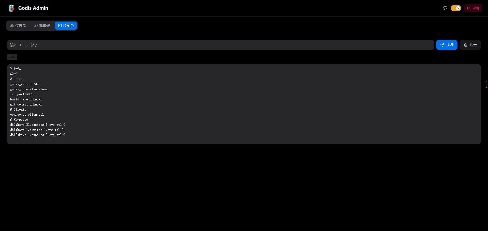

<p align="center"></p>

<h1 align="center">Godis</h1>

> 使用 Go 语言编写的 Redis 兼容内存键值数据库。

Godis 是一款轻量级、基于 AI 开发的、以学习为目的的键值数据库，支持 [RESP 协议](https://redis.io/docs/latest/develop/reference/protocol-spec/)，与标准 Redis 客户端（redis-cli、go-redis 等）完全兼容。

## 特性

- **5 种数据结构**：String、Hash、List、Set、Sorted Set（ZSet）全部实现，覆盖 ~115 个命令
- **RESP 协议**：同时支持标准 `*数组` 格式和内联命令
- **16 个逻辑数据库**：通过 SELECT 实现多数据库隔离
- **AOF 持久化**：Append-Only File，混合二进制快照 + 文本命令增量日志
- **自动重写**：当 AOF 文件超过阈值时后台自动压缩
- **键过期**：支持 TTL，访问时惰性删除 + 定期 GC 清理
- **发布订阅**：PUBLISH / SUBSCRIBE / PSUBSCRIBE + 模式匹配
- **连接认证**：AUTH 密码认证，支持 CONFIG SET 动态管理
- **Web 管理后台**：内嵌 React 管理界面，可视化操作数据，支持仪表盘/键管理/控制台
- **Redis 客户端兼容**：支持 redis-cli、go-redis 等所有 RESP 客户端

## 快速开始

### 构建

```bash
go build -o godis .
```

### 运行

```bash
./godis --config ./etc/godis.yaml
```

配置文件不存在时会自动生成默认配置，`--config` 参数可省略。

### 连接

```bash
redis-cli -p 6389
```

```
127.0.0.1:6389> PING
PONG
127.0.0.1:6389> SET foo bar
OK
127.0.0.1:6389> GET foo
"bar"
127.0.0.1:6389> HSET myhash field1 hello
(integer) 1
127.0.0.1:6389> LPUSH mylist a b c
(integer) 3
127.0.0.1:6389> SADD myset x y z
(integer) 3
127.0.0.1:6389> ZADD leaderboard 100 player1 200 player2
(integer) 2
```

## 命令列表

### 字符串

| 命令 | 说明 |
|------|------|
| `SET` | 设置字符串值，支持 EX 过期 |
| `MSET` | 批量设置多个 key-value |
| `GET` | 获取字符串值 |
| `MGET` | 批量获取多个 key 的值 |
| `GETSET` | 设置新值并返回旧值 |
| `APPEND` | 追加到已有字符串或创建新键 |
| `STRLEN` | 返回字符串的长度 |
| `GETRANGE` | 返回字符串的子串 |
| `BITCOUNT` | 统计比特位为 1 的数量 |
| `INCR` / `INCRBY` | 整数值递增 |
| `DECR` / `DECRBY` | 整数值递减 |

### Hash

| 命令 | 说明 |
|------|------|
| `HSET` / `HMSET` | 设置一个或多个 field 的值 |
| `HGET` / `HMGET` | 获取一个或多个 field 的值 |
| `HGETALL` | 返回所有 field-value 对 |
| `HKEYS` | 返回所有 field 名称 |
| `HVALS` | 返回所有 value |
| `HDEL` | 删除一个或多个 field |
| `HEXISTS` | 检查 field 是否存在 |
| `HLEN` | 返回 field 数量 |
| `HSTRLEN` | 返回 field 值的长度 |
| `HSCAN` | 增量迭代 field |

### List

| 命令 | 说明 |
|------|------|
| `LPUSH` / `RPUSH` | 左/右推入元素 |
| `LPUSHX` / `RPUSHX` | 仅 key 存在时推入 |
| `LPOP` / `RPOP` | 左/右弹出元素（支持 count） |
| `LLEN` | 返回列表长度 |
| `LINDEX` | 获取指定位置的元素 |
| `LINSERT` | 在 pivot 前/后插入元素 |
| `LRANGE` | 获取指定范围的元素 |
| `LREM` | 移除匹配的元素 |
| `LSET` | 设置指定位置的值 |
| `LPOS` | 查找元素位置 |
| `LMOVE` | 原子移动元素到另一列表 |
| `BLPOP` / `BRPOP` | 阻塞弹出（非阻塞简化实现） |
| `BLMOVE` | 阻塞移动（非阻塞简化实现） |

### Set

| 命令 | 说明 |
|------|------|
| `SADD` | 添加成员 |
| `SCARD` | 返回成员数 |
| `SISMEMBER` | 判断成员是否存在 |
| `SMISMEMBER` | 批量判断成员是否存在 |
| `SMEMBERS` | 返回所有成员 |
| `SPOP` | 随机弹出成员 |
| `SRANDMEMBER` | 随机返回成员（不移除） |
| `SREM` | 移除成员 |
| `SMOVE` | 移动成员到另一集合 |
| `SINTER` / `SINTERSTORE` | 交集及其存储 |
| `SINTERCARD` | 交集大小 |
| `SUNION` / `SUNIONSTORE` | 并集及其存储 |
| `SDIFF` / `SDIFFSTORE` | 差集及其存储 |
| `SSCAN` | 增量迭代成员 |

### Sorted Set

| 命令 | 说明 |
|------|------|
| `ZADD` | 添加成员及分数 |
| `ZCARD` | 返回成员数 |
| `ZCOUNT` | 按分数统计成员数 |
| `ZSCORE` / `ZMSCORE` | 获取成员分数 |
| `ZINCRBY` | 增加成员分数 |
| `ZRANK` / `ZREVRANK` | 正序/倒序排名 |
| `ZRANGE` / `ZREVRANGE` | 按索引范围返回（支持 REV/BYSCORE/BYLEX/WITHSCORES/LIMIT） |
| `ZRANGEBYSCORE` | 按分数范围返回 |
| `ZRANGEBYLEX` | 按字典序返回 |
| `ZRANGESTORE` | 保存范围到目标集合 |
| `ZREM` | 移除成员 |
| `ZREMRANGEBYSCORE` / `ZREMRANGEBYRANK` / `ZREMRANGEBYLEX` | 按条件移除 |
| `ZPOPMAX` / `ZPOPMIN` | 弹出最高/最低分 |
| `ZMPOP` | 多集合弹出 |
| `ZRANDMEMBER` | 随机返回成员 |
| `ZUNION` / `ZUNIONSTORE` | 并集（支持 WEIGHTS/AGGREGATE） |
| `ZINTER` / `ZINTERSTORE` / `ZINTERCARD` | 交集 |
| `ZDIFF` / `ZDIFFSTORE` | 差集 |
| `ZLEXCOUNT` | 字典序统计 |
| `ZSCAN` | 增量迭代 |

### 键操作

| 命令 | 说明 |
|------|------|
| `DEL` | 删除一个或多个键 |
| `UNLINK` | 异步删除 |
| `EXISTS` | 统计存在的键数量 |
| `EXPIRE` / `PEXPIRE` | 设置过期时间（秒/毫秒） |
| `TTL` / `PTTL` | 查看剩余过期时间 |
| `PERSIST` | 移除过期时间 |
| `MOVE` | 将键移动到另一数据库 |
| `TYPE` | 查看数据类型 |
| `TOUCH` | 更新最后访问时间 |
| `DBSIZE` | 返回当前数据库键数量 |
| `FLUSHDB` / `FLUSHALL` | 清空数据库 |
| `SORT` | 对列表/集合排序 |
| `SCAN` | 增量迭代键空间 |

### 服务器 & 连接

| 命令 | 说明 |
|------|------|
| `PING` | 测试连接 |
| `TIME` | 服务器时间 |
| `SHUTDOWN` | 关闭服务器 |
| `SELECT` | 切换数据库 |
| `AUTH` | 密码认证 |
| `INFO` | 服务器信息与统计 |
| `COMMAND` | 命令信息查询 |
| `CONFIG GET/SET/REWRITE` | 配置管理 |
| `BGREWRITEAOF` | 触发 AOF 重写 |
| `MEMORY STATS/USAGE` | 内存统计 |
| `HELLO` | 握手 |

### 发布订阅

| 命令 | 说明 |
|------|------|
| `PUBLISH` | 向频道发布消息 |
| `SUBSCRIBE` | 订阅频道 |
| `UNSUBSCRIBE` | 退订频道 |
| `PSUBSCRIBE` | 模式订阅 |
| `PUNSUBSCRIBE` | 模式退订 |
| `PUBSUB` | 查看订阅状态 |

## 项目结构

```
godis/
├── main.go                  # 入口：配置加载、日志初始化、数据库创建、AOF、启动服务
├── commands/                # 命令处理器（按类别分文件）
│   ├── router.go            #   命令注册、Execute 分发、Flag 常量定义
│   ├── strings.go           #   字符串命令
│   ├── hash.go              #   Hash 命令
│   ├── list.go              #   List 命令
│   ├── set.go               #   Set 命令
│   ├── zset.go              #   Sorted Set 命令
│   ├── keys.go              #   键操作命令
│   ├── server.go            #   INFO、COMMAND、CONFIG、BGREWRITEAOF
│   ├── connection.go        #   AUTH、SHUTDOWN、TIME、HELLO
│   ├── memory.go            #   MEMORY STATS/USAGE
│   └── pubsub.go            #   PUBLISH、SUBSCRIBE 等
├── pubsub/                  # 发布订阅 Hub 管理器
├── config/                  # YAML 配置（加载、保存、默认值）
├── datastore/               # 核心存储引擎
│   ├── db.go                #   GodisDB：键值 CRUD、过期处理、GC 协程
│   ├── aof.go               #   AOF 日志：追加写入、混合重写、自动重写协程
│   └── gdb.go               #   Gob 二进制快照（序列化/反序列化）
├── recovery/                # 启动时 AOF 数据恢复
├── server/                  # TCP 服务器：监听、接受连接、处理客户端
├── protocol/                # RESP 协议解析器 + 响应构造
├── types/                   # 数据类型实现（String、Hash、List、Set、ZSet）
├── logger/                  # 模块化日志（lumberjack 滚动切割）
├── version/                 # 编译时注入的版本信息
├── integration/             # 集成测试（独立 Go module，依赖 go-redis）
├── build/                   # 构建产物（Go embed 前端资源）
├── webadmin/                # Web 管理后台（独立包：路由、处理、监控）
├── web/                     # 前端源码（React + NextUI + Tailwind v3）
├── web_embed.go             # 前端 dist 静态资源嵌入
├── etc/godis.yaml           # 配置文件
├── go.mod                   # 主模块依赖
├── go.work                  # Go workspace（主模块 + 集成测试）
├── Makefile                 # 构建/测试/交叉编译
├── Dockerfile               # 多阶段 Docker 构建
└── all_test.go              # 单元测试编排
```

## 架构设计

### 数据流

```
redis-cli ──► TCP ──► ParseRESP ──► Execute(命令) ──► GodisDB ──► AOF 写入
                              │
                              ├──► PubSub Hub ──► 订阅者推送
                              │
                              ▼
                        响应构造 ──► redis-cli
```

### AOF 持久化

- **追加写入**：所有写命令以 RESP 文本格式追加到 AOF 文件，非 0 号数据库自动添加 SELECT 前缀
- **混合重写**：定期将 AOF 压缩为 Gob 二进制快照（GODIS-HYBRID 头部），后续增量以文本格式追加
- **自动重写触发条件**（每 10 秒检查）：首次写入 > 2 KB / 增长 > 64 MB / 增长 > 50%

### 键过期

- **惰性删除**：访问时检查并删除已过期键
- **主动 GC**：后台协程每秒遍历所有数据库，批量清理过期键

### 发布订阅

- Hub 全局单例管理频道 → 客户端映射
- 支持精确匹配 + glob 模式匹配（`*`/`?`）
- 客户端断开自动清理订阅

### 认证

- `requirepass` 配置项控制是否启用
- 未认证连接仅允许 AUTH 和 PING，其余返回 NOAUTH
- 支持 CONFIG SET requirepass 运行时修改

## 配置说明

```yaml
# Godis configuration file

bind: 0.0.0.0
port: 6389
databases: 16
aof_file: ./data/godis.aof
log_file: ./logs/godis.log
log_level: info
# requirepass: mypassword   # 取消注释启用认证
```

| 配置项 | 默认值 | 说明 |
|--------|--------|------|
| `bind` | `0.0.0.0` | 监听地址 |
| `port` | `6379` | TCP 端口 |
| `databases` | `16` | 逻辑数据库数量 |
| `aof_file` | `./data/godis.aof` | AOF 持久化文件路径 |
| `log_file` | `./logs/godis.log` | 日志文件 |
| `log_level` | `info` | 日志级别：debug/info/warn/error |
| `requirepass` | (空) | 认证密码，留空不启用 |
| `web_admin` | `true` | 是否启用 Web 管理后台 |
| `web_bind` | `127.0.0.1` | Web 后台监听地址 |
| `web_port` | `6390` | Web 后台监听端口 |

支持运行时通过 `CONFIG SET` 修改 `log_level` 和 `requirepass`，`CONFIG REWRITE` 持久化。

## Web 管理后台

启动 godis 后，浏览器打开 `http://127.0.0.1:6390` 即可使用。

### 仪表盘



- 服务器运行状态（版本、运行时间、键总数、内存、CPU）
- 各数据库键数柱状图
- CPU / 内存实时折线图（最近 3 分钟趋势）
- 实时日志终端（关键字高亮：ERROR/WARN/DEBUG）

### 键管理



- 16 数据库独立切换 + 模式搜索（`*` glob）
- 键列表（排序、分页、多选，选中行紫色高亮）
- 键详情面板：查看 / 编辑 / 删除（按 String/Hash/List/Set/ZSet 类型适配）
- 修改 TTL、重命名、批量删除（确认弹窗）
- 新增 Key（弹窗表单，根据类型动态展开 value 字段）

### 控制台



- 自定义命令输入 + 执行（切换页面不丢失状态）
- 命令自动补全（从后端命令注册表动态获取）
- 历史记录去重 + 最新结果置顶


## 测试

> 后端 API 文档见 [docs/api.md](docs/api.md)。

### 单元测试

```bash
go test ./...
```

覆盖 commands / types / datastore / config / logger / protocol / pubsub 等包。

### 集成测试

需要 `go-redis`（自动下载），会编译 godis 二进制并在真实 TCP 服务器上测试所有 115+ 个命令：

```bash
go test -v ./integration/ -count=1
```

输出包含每个测试的操作日志，以及最终统计汇总（带失败用例定位）：

```
============================================================
  INTEGRATION TEST SUMMARY
============================================================
  ✅ PASSED: 115
  ❌ FAILED: 0
  📊 TOTAL:  115
============================================================
```

## 性能压测

### 压测工具

```bash
# 一键全量压测
make benchmark

# 横向对比 Godis vs Redis
make compare

# Go 微基准
go test -bench . -benchtime=3s ./benchmark/

# 自定义参数
go run benchmark/ -host 127.0.0.1 -port 6389 -n 100000 -c 50 -d 128
```

详见 `benchmark/README.md`。

### Godis vs Redis 横向对比

**环境**: Intel Xeon Silver 4314 @ 2.40GHz / 8 核 / 50 并发 / 10 万请求

| 命令 | Godis (ops/s) | Redis (ops/s) | Ratio |
|------|--------------|--------------|-------|
| PING | 135,959 | 181,633 | 0.75x |
| SET | 133,493 | 161,073 | 0.83x |
| GET | 129,529 | 186,158 | 0.70x |
| LPUSH | 130,775 | 153,060 | 0.85x |
| RPOP | 128,302 | 165,225 | 0.78x |
| SADD | 130,278 | 186,689 | 0.70x |
| SPOP | 132,839 | 191,242 | 0.69x |
| HSET | 122,819 | 172,653 | 0.71x |
| HGET | 135,697 | 183,411 | 0.74x |
| ZADD | 126,819 | 163,916 | 0.77x |
| ZRANGE | 129,761 | 176,906 | 0.73x |
| PUBLISH | 127,074 | 180,430 | 0.70x |
| **平均** | **~131k** | **~177k** | **~0.75x** |

godis 达到 Redis 约 **75% 的单机吞吐量**，延迟均匀无瓶颈。差距主要来自 Go GC 开销、`interface{}` 类型断言以及 AOF 持久化写盘。对于 10 万 QPS 以下场景完全胜任，List 操作（LPUSH 0.85x）表现尤其接近。

## 构建时注入版本信息

```bash
go build -ldflags "\
  -X godis/version.Version=1.0.0 \
  -X godis/version.BuildTime=$(date -u +%Y-%m-%dT%H:%M:%S) \
  -X godis/version.GitCommit=$(git rev-parse --short HEAD)" \
  -o godis .
```

## 依赖

| 包 | 用途 |
|----|------|
| `gopkg.in/yaml.v3` | 配置文件解析 |
| `gopkg.in/natefinch/lumberjack.v2` | 日志文件滚动 |
| `github.com/redis/go-redis/v9` | 集成测试（独立模块） |

## TODO

- [ ] 集群模式
- [ ] Lua 脚本：EVAL、EVALSHA
- [ ] 事务：MULTI、EXEC、DISCARD、WATCH
- [ ] Stream 消息队列：XADD、XREAD、XGROUP
- [ ] 主从复制
- [ ] RESP3 协议支持
- [ ] TLS 加密连接
- [ ] ACL 权限控制
